# 类型同步快速参考

## 一键命令

```bash
# 同步前后端类型（推荐）
pnpm types:sync

# 或分步执行
pnpm --filter api openapi:export  # 1. 导出 OpenAPI
pnpm --filter web api:generate    # 2. 生成前端代码
```

## 开发流程

```mermaid
graph LR
    A[修改后端 API] --> B[pnpm types:sync]
    B --> C[前端获得类型]
    C --> D[开发前端功能]
```



## 使用示例

### 查询列表

```typescript
import { useListUsersApiV1UsersGet } from "@/api/endpoints/users/users";

const { data: users, isPending } = useListUsersApiV1UsersGet({
  skip: 0,
  limit: 10,
});
```

### 创建数据

```typescript
import { useCreateUserApiV1UsersPost } from "@/api/endpoints/users/users";
import type { UserCreate } from "@/api/models";

const createUser = useCreateUserApiV1UsersPost();

createUser.mutate({
  data: {
    email: "test@example.com",
    name: "Test User",
  },
});
```

### 更新数据

```typescript
import { useUpdateUserApiV1UsersUserIdPatch } from "@/api/endpoints/users/users";

const updateUser = useUpdateUserApiV1UsersUserIdPatch();

updateUser.mutate({
  userId: 1,
  data: { name: "New Name" },
});
```

### 删除数据

```typescript
import { useDeleteUserApiV1UsersUserIdDelete } from "@/api/endpoints/users/users";

const deleteUser = useDeleteUserApiV1UsersUserIdDelete();

deleteUser.mutate({ userId: 1 });
```

## 文件位置

| 类型         | 位置                            |
| ------------ | ------------------------------- |
| 后端 Schema  | `apps/api/app/schemas/`         |
| 后端路由     | `apps/api/app/api/v1/`          |
| OpenAPI 规范 | `apps/api/openapi/openapi.json` |
| 前端 Hooks   | `apps/web/src/api/endpoints/`   |
| 前端类型     | `apps/web/src/api/models/`      |
| Fetch 客户端 | `apps/web/src/api/client.ts`    |

## 常见问题

### Q: 类型不匹配？

```bash
pnpm types:sync
```

### Q: 导入路径错误？

```typescript
// ✅ 正确
import { useListUsersApiV1UsersGet } from "@/api/endpoints/users/users";

// ❌ 错误
import { useListUsersApiV1UsersGet } from "api/endpoints/users/users";
```

### Q: 需要添加认证？

编辑 `apps/web/src/api/client.ts`:

```typescript
headers: {
  'Content-Type': 'application/json',
  Authorization: `Bearer ${getToken()}`,
  ...rest.headers,
}
```

## 禁止事项

❌ 手动编写 API 调用
❌ 手动定义接口类型
❌ 修改生成的文件
❌ 提交生成的文件到 Git

## 团队协作

拉取代码后：

```bash
pnpm install
pnpm types:sync
```

提交代码前：

```bash
pnpm types:sync
pnpm --filter web build
```

## 详细文档

📖 [完整文档](./TYPE_SYNC.md)
